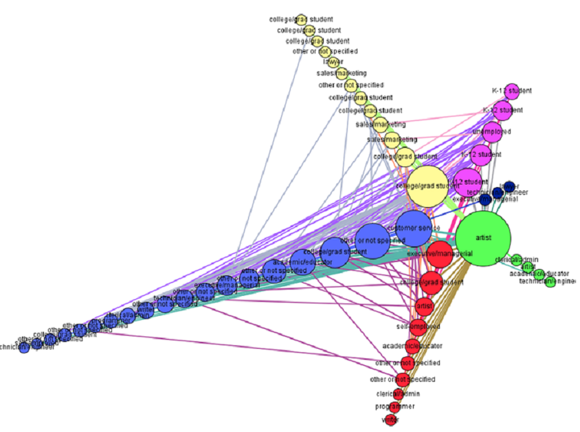

```{r setup, include = FALSE}
# setup
source("mycugtest.R")
source("myqaptest.R")

library(network)
library(ergm)
library(latticeExtra)
library(intergraph)
library(sand)

#setwd('C:/Users/alexherseg/Documents/School/2_Spring_14_15/csc495/csc495_project')
setwd('C:/Users/alexherseg/Documents/School/2_Spring_14_15/csc495/csc495_project/project_submission')
source("lab4-utils.R")
```

### 1. First, we load the network from a text file in edgelist form and turn it into a bipartite graph.

```{r load data}
# read the data, turn into graph object
horror_movies <- read.csv('horror_movies.txt', sep = ';', header = FALSE)
h <- graph.data.frame(horror_movies, directed = FALSE)

# turn graph into bipartite
V(h)$type <- V(h)$name %in% horror_movies[,1]

# check if bipartite
igraph::is.bipartite(h)
```

## User-User Network

### 2. We extract the user-user projection and add the following information for each user:
* gender
* the age group
* occupation
* randomly generated name

```{r user-user projection}
# user to user projection
users_proj <- bipartite.projection(h)$proj2

# we add user information
users <- read.csv('user_info.txt', sep = ';', header = FALSE)
names(users) <- c('user_id', 'gender', 'age_group', 'occupation')
u <- get.data.frame(users_proj)
user_net <- graph.data.frame(u, directed = FALSE, vertices = users)

# here we use the randomNames package to assign users names
# (it's easier to identify users by a name than a number)
# library(randomNames)
# random_names <- randomNames(length(user_net), gender=V(user_net)$gender)
# save(random_names, file = 'random_names.Rdata')
load('random_names.Rdata')
V(user_net)$user_random_name <- random_names
```

### 3. Now, we examine the user information.

```{r user network info summaries}
summary(user_net)
table(V(user_net)$gender)
table(V(user_net)$age_group)
table(V(user_net)$occupation)
```

### 4. We examine assortativity of gender, age_group, occupation.



```{r assortativity}
# homophily by gender
# table(V(user_net)$gender)
gender <- as.factor(V(user_net)$gender)
gender <- as.integer(gender)
# table(gender)
assortativity.nominal(user_net, gender, directed = FALSE)

# homophily by age
# table(V(user_net)$age_group)
age_group <- as.factor(V(user_net)$age_group)
age_group <- as.integer(age_group)
# table(age_group)
assortativity.nominal(user_net, age_group, directed = FALSE)

# homophily by occupation
# table(V(user_net)$occupation)
occupation <- as.factor(V(user_net)$occupation)
job <- as.integer(occupation)
# table(job)
assortativity.nominal(user_net, job, directed = FALSE)
```

### 5. CUG tests
That is to say, are movie reviewers likely to around others who are similar than them in terms of gender, age, or occupation?
Null Hypothesis: the likelihood that users are around similar users is due to random edge formation.

```{r CUG tests}
# user_gender_CUG <- mycugtest(user_net, assortativity.nominal, types = gender)
# save(user_gender_CUG, file = 'user_gender_CUG.Rdata')
load('user_gender_CUG.Rdata')
print.cug.test(user_gender_CUG)
# plot.cug.test(user_gender_CUG)

# note: the CUG test will take some time; about 1min30sec on my computer
# user_age_CUG <- mycugtest(user_net, assortativity.nominal, types = age_group)
#save(user_age_CUG, file = 'user_age_CUG.Rdata')
load('user_age_CUG.Rdata')
print.cug.test(user_age_CUG)
# plot.cug.test(user_age_CUG)

# user_job_CUG <- mycugtest(user_net, assortativity.nominal, types = job)
# save(user_job_CUG, file = 'user_job_CUG.Rdata')
load('user_job_CUG.Rdata')
print.cug.test(user_job_CUG)
# plot.cug.test(user_job_CUG)
```

##### Gender and age group are significant.

### 6. QAP tests
Null hypothesis: The likelihood that users are near similar users to themselves is due to random placement of nodes.


```{r QAP tests}
#user_age_qap <- myqaptest(user_net, assortativity.nominal, types = age_group, directed = FALSE)
load('user_age_qap.Rdata')
summary.qaptest(user_age_qap)
# plot.qaptest(user_age_qap)

#user_gender_qap <- myqaptest(user_net, assortativity.nominal, types = gender, directed = FALSE)
load('user_gender_qap.Rdata')
summary.qaptest(user_gender_qap)
# plot.qaptest(user_gender_qap)

#user_job_qap <- myqaptest(user_net, assortativity.nominal, types = job, directed = FALSE)
load('user_job_qap.Rdata')
summary.qaptest(user_job_qap)
# plot.qaptest(user_job_qap)
```

##### Gender is significant, and age_group is borderline significant.

```{r CUG and QAP plots}
par(mfrow=c(2,3))
plot.cug.test(user_age_CUG)
plot.cug.test(user_gender_CUG)
plot.cug.test(user_job_CUG)
plot.qaptest(user_age_qap)
plot.qaptest(user_gender_qap)
plot.qaptest(user_job_qap)
par(mfrow=c(1,1))
```

### 7. Now, we try to quantify the effects of gender and age by constructing an ERGM model.

```{r ergm full graph}
# ergm models of whole user-user projection ----------------------------------

# we tried to add these network measures to try to improve the model
#V(user_net)$deg.cen <- degree(user_net, normalized = TRUE)  
#V(user_net)$cness <- closeness(user_net)
#V(user_net)$bness <- betweenness(user_net)
#V(user_net)$ev.cen <- evcent(user_net)$vector
#V(user_net)$pgrank <- page.rank(user_net)$vector
#V(user_net)$bon.75 <- bonpow(user_net, exponent = .75)
#V(user_net)$bon.neg1 <- bonpow(user_net, exponent = -1)
#V(users.flt)$trans <- transitivity(user_net, 'local')

# our base model:
# user.net <- asNetwork(user_net)
# user_M0 <- ergm(user.net ~ edges, verbose = T)
load('user_M0.Rdata')
summary(user_M0)

# user_m0.gofm <- gof(user_M0, GOF=~model)
# user_m0.gofm
# plot(user_m0.gofm)

# user_m0.gofm <- gof(user_M0)
# plot(user_m0.gofm)

#user_M1 <- ergm(user.net ~ edges + degree(7), verbose = T)
#user_M1 <- ergm(user.net ~ edges + nodecov('deg.cen') + degree(7), verbose = T)
#user_M1 <- ergm(user.net ~ edges + nodematch('gender', diff=T), verbose = T)
#user_M1 <- ergm(user.net ~ edges + nodematch('age_group', diff=T), verbose = T)
#user_M1 <- ergm(user.net ~ edges + nodematch('gender', diff=T) + nodematch('age_group', diff=T), verbose = T)
#user_M1 <- ergm(user.net ~ edges + degree(c(6, 8)) + nodematch('gender', diff=T) + nodematch('age_group', diff=T), verbose = T)
#save(user_M1, file = 'user_m1.Rdata')
load('user_m1.Rdata')
summary(user_M1)
```

### 8. With the full graph we do not get a good model, so here we filter our users network.

```{r user network filtering}
edge.weights <- E(user_net)$weight
# hist(edge.weights)
table(edge.weights)
# lots of edges <= 2 means that alot of users don't connect, don't review the same movies

# remove edges with weights less than 7 and age group 50-55 
# this was done because there were too few users in this age group and
# they would create errors in the model
users.flt <- igraph::delete.edges(user_net , which(edge.weights < 7))
users.flt <- igraph::delete.vertices(users.flt , which(V(users.flt)$age_group == '50-55'))

# create a histogram of weighted degree
weighted_degree <- graph.strength(users.flt) 
# hist(weighted_degree)
table(weighted_degree)

# Remove vertices with weighted degrees less than 7
users.flt <- igraph::delete.vertices(users.flt , which(weighted_degree < 7))

# remove singleton nodes
remove.singletons <- function(graph){
  deg <- degree(graph)
  singles <- which(deg == 0)
  new_graph <- graph - singles
  return(new_graph)
}
users.flt <- remove.singletons(users.flt)
# weighted_degree <- graph.strength(users.flt) 
# table(weighted_degree)
# plot(users.flt, vertex.label = V(users.flt)$user_random_name)
table(degree(users.flt))

# degree centrality and eigenvector were the best ones
#V(users.flt)$deg.cen <- degree(users.flt, normalized = TRUE)  
#V(users.flt)$cness <- closeness(users.flt)
#V(users.flt)$bness <- betweenness(users.flt)
V(users.flt)$ev.cen <- evcent(users.flt)$vector
#V(users.flt)$pgrank <- page.rank(users.flt)$vector
#V(users.flt)$bon.75 <- bonpow(users.flt, exponent = .75)
#V(users.flt)$bon.neg1 <- bonpow(users.flt, exponent = -1)
#V(users.flt)$trans <- transitivity(users.flt, 'global')
#E(users.flt)$weight
```

### 9. The base ergm model of the filtered user network with only edges

```{r ergm base model on filtered graph} 
# our base model
# user_flt.net <- asNetwork(users.flt)
# user_flt_M0 <- ergm(user_flt.net ~ edges, verbose = T)
load('user_flt_M0.Rdata')
summary(user_flt_M0)

#user_m0.gofm <- gof(user_flt_M0, GOF=~model)
#user_m0.gofm
#plot(user_m0.gofm)

#user_m0.gofm <- gof(user_flt_M0)
#user_m0.gofm
#par(mfrow=c(3,1))
#plot(user_m0.gofm)
#par(mfrow=c(1,1))
```

### 10. The improved model (and other models we tried, but weren't as good):

```{r our improved model}
# add degree(7) nodes, which were underrepresented in first model
# user_flt_M1 <- ergm(user_flt.net ~ edges + degree(7), verbose = T)
# and other ergm models we tried
# user_flt_M1 <- ergm(user_flt.net ~ edges + degree(7) + 
#                    nodematch('gender', diff=T), verbose = T)
#user_flt_M1 <- ergm(user_flt.net ~ edges + degree(7) + 
#                    nodematch('age_group', diff=T), verbose = T)
#user_flt_M1 <- ergm(user_flt.net ~ edges + degree(7) + 
#                    nodematch('gender') + 
#                    nodematch('age_group', diff=T), verbose = T)
#user_flt_M1 <- ergm(user_flt.net ~ edges + degree(7) + nodematch('gender') + 
#                    nodematch('age_group', diff=T), 
#                    control = control.ergm(MCMC.burnin = 50000, 
#                                           MCMC.interval = 5000), verbose = T)
#user_flt_M1 <- ergm(user_flt.net ~ edges + nodecov('deg.cen') + 
#                    degree(7), verbose = T) # so far, this is the best model
#user_flt_M2 <- ergm(user_flt.net ~ edges + nodecov('cness') + 
#                    degree(7), verbose = T)
#user_flt_M2 <- ergm(user_flt.net ~ edges + nodecov('bness') + 
#                    degree(7), verbose = T)
#user_flt_M2 <- ergm(user_flt.net ~ edges + nodecov('ev.cen') + 
#                    degree(7), verbose = T)
#user_flt_M1 <- ergm(user_flt.net ~ edges + nodecov('pgrank') + 
#                    degree(7), verbose = T)
#summary(user_flt_M1)
#summary(user_flt_M2)

#user_flt_M3 <- ergm(user_flt.net ~ edges 
#                    + nodecov('ev.cen') 
#                    + nodematch('gender', diff = TRUE)
#                    + degree(7), verbose = T)
#user_flt_M3 <- ergm(user_flt.net ~ edges 
#                    + nodecov('ev.cen') 
#                    + nodematch('age_group', diff = TRUE)
#                    + degree(7), verbose = T)
#user_flt_M3 <- ergm(user_flt.net ~ edges 
#                    + nodecov('ev.cen')
#                    + nodematch('gender', diff = TRUE)
#                    + nodematch('age_group', diff = TRUE)
#                    + degree(7), verbose = T)
load('user_flt_M3.Rdata')
summary(user_flt_M3)

mcmc.diagnostics(user_flt_M3)
user_m3.gofm <- gof(user_flt_M3, GOF=~model)
user_m3.gofm
plot(user_m3.gofm)

user_m3.gofm <- gof(user_flt_M3)
user_m3.gofm
#par(mfrow=c(3,1))
plot(user_m3.gofm)
#par(mfrow=c(1,1))
```

### 11. Here we try to interpret the log-odds.

```{r log-odds and probability}
# we tried interpreting the log odds, but were unsuccessful, even with constantly referring to the documentation

edge <- coef(user_flt_M3)[1]
ev <- coef(user_flt_M3)[2]
f <- coef(user_flt_M3)[3]
m <- coef(user_flt_M3)[4]
u18 <- coef(user_flt_M3)[5]
u25 <- coef(user_flt_M3)[6]
u35 <- coef(user_flt_M3)[7]
u45 <- coef(user_flt_M3)[8]
under18 <- coef(user_flt_M3)[9]
deg1 <- coef(user_flt_M3)[10]
deg7 <- coef(user_flt_M3)[11]

case1.lo <- edge + ev + f + under18 + deg1
case2.lo <- edge + ev + f + u18 + deg1
case3.lo <- edge + ev + f + u25 + deg1
case4.lo <- edge + ev + f + u35 + deg1
case5.lo <- edge + ev + f + u45 + deg1

case6.lo <- edge + ev + m + under18 + deg1
case7.lo <- edge + ev + m + u18 + deg1
case8.lo <- edge + ev + m + u25 + deg1
case9.lo <- edge + ev + m + u35 + deg1
case10.lo <- edge + ev + m + u45 + deg1

df_females <- data.frame(case1 = invlogit(case1.lo),
                 case2 = invlogit(case2.lo),
                 case3 = invlogit(case3.lo),
                 case4 = invlogit(case4.lo),
                 case5 = invlogit(case5.lo))

df_males <- data.frame(case6 = invlogit(case6.lo),
                 case7 = invlogit(case7.lo),
                 case8 = invlogit(case8.lo),
                 case9 = invlogit(case9.lo),
                 case10 = invlogit(case10.lo))
```

### 12. Community Detection

```{r community detection}
# community detection --------------------------------------------------------
# run the leading eigenvector clustering using weights
users.eigen <- leading.eigenvector.community(users.flt)
sizes(users.eigen)
V(users.flt)$eigen.com <- as.character(membership(users.eigen))
#plot(users.flt, vertex.label = V(users.flt)$user_random_name, vertex.color=membership(users.eigen))

# save this graph object as graphml so we can use it in Gephi
# write.graph(users.flt, 'users_flt.graphml', format = 'graphml')

# other community detection algorithms we tried -----------------------------
# run the walktrap community detection
users.walk <- walktrap.community(users.flt)
#users.walk
sizes(users.walk)
#membership(users.walk)

#users.walk.clust <- as.hclust(users.walk)
#plot(users.walk.clust)
#plot(users.flt, vertex.label=V(users.flt)$user_random_name, vertex.color=membership(users.walk))
```

### other analysis we attempted, but did not use in our report:

```{r other}
# link prediction ------------------------------------------------------------

# compute link prediction by jaccard similarity
link_pred <- similarity.jaccard(users.flt, vids = V(users.flt), mode = c("all"), loops = FALSE) 
for (i in 1:ncol(link_pred)){
  link_pred[i, i] <- 0
}

link_pred <- similarity.dice(users.flt, vids = V(users.flt), mode = c("all")) 
for (i in 1:ncol(link_pred)){
  link_pred[i, i] <- 0
}

link_pred <- similarity.invlogweighted(users.flt, vids = V(users.flt), mode = c("all")) 
for (i in 1:ncol(link_pred)){
  link_pred[i, i] <- 0
}

l <- apply(link_pred, 2, max)

for (k in seq_along(l)) {
  if (l[k] == 1.0) { # l[k] == 1.0 jaccard, l[k] > 5, invlogweighted
  print(paste('k:', k, 'most similar:', which(link_pred[ ,k] == l[k])))
  }
}

# movie-movie projection -----------------------------------------------------
movie_net <- bipartite.projection(h)$proj1
summary(movie_net)

# Create a histogram of edge weight
edge.weights <- E(movie_net)$weight
table(edge.weights)

# Remove edges with weights less than 7
movies.flt <- igraph::delete.edges(movie_net , which(edge.weights < 7))
movies.flt <- remove.singletons(movies.flt)

# Create a histogram of weighted degree
weighted_degree <- graph.strength(movies.flt) 
hist(weighted_degree)
table(weighted_degree)

# Remove singleton nodes
remove.singletons <- function(graph){
  deg <- degree(graph)
  singles <- which(deg == 0)
  new_graph <- graph - singles
  return(new_graph)
}

movies.flt <- remove.singletons(movies.flt)

# run walktrap community detection
movies.walk <- walktrap.community(movies.flt)
sizes(movies.walk)

# dendrogram
movies.walk.clust <- as.hclust(movies.walk)
#png('movies_clust.png')
plot(movies.walk.clust)
#dev.off()

# filtered movies plot with membership from walktrap
plot(movies.flt, vertex.color=membership(movies.walk))

# Extract any one of these clusters into a seperate network
movies.c1 <- induced.subgraph(movies.flt, which(membership(movies.walk)==1))
par(mai=c(.1,.1,.1,.1))
plot(movies.c1)
```
